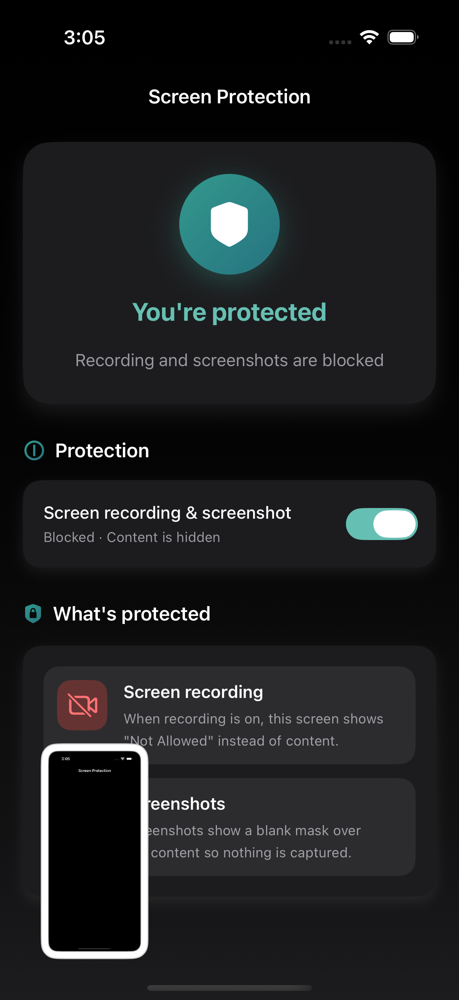
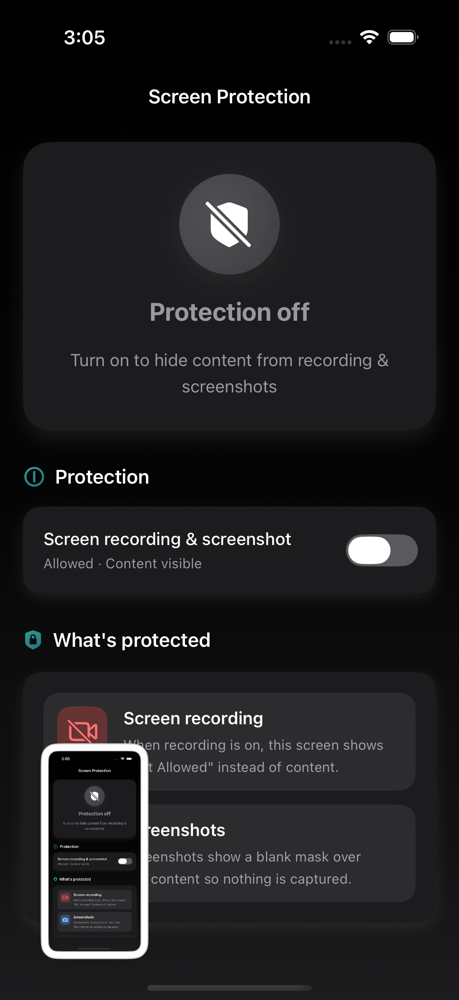
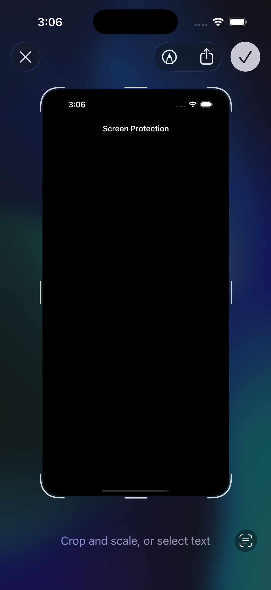

# ScreenProtection (SwiftUI Demo)

Educational demo showing how to hide sensitive UI during screenshots and
screen recording in iOS using public APIs.

## Disclaimer

iOS does not provide an official API to fully block screenshots or screen recording.
This project does not stop capture — it hides UI content during capture.
Shared strictly for educational purposes.

## Features

- SwiftUI demo with toggle to enable / disable protection
- Screenshot protection using secure text-entry masking
- Screen recording detection using `UIScreen.isCaptured`
- Recording-time UI replacement using `ContentUnavailableView` (iOS 17+)

## Screenshots

|  |  |  |
|---|---|---|
|  |  |  |

## Usage

Apply the modifier to any SwiftUI screen:

```swift
.screenProtection(enabled: true)

